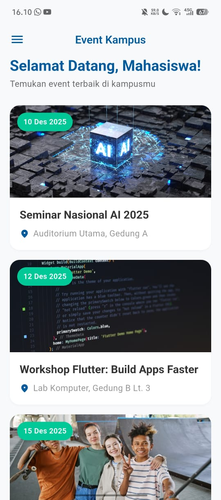
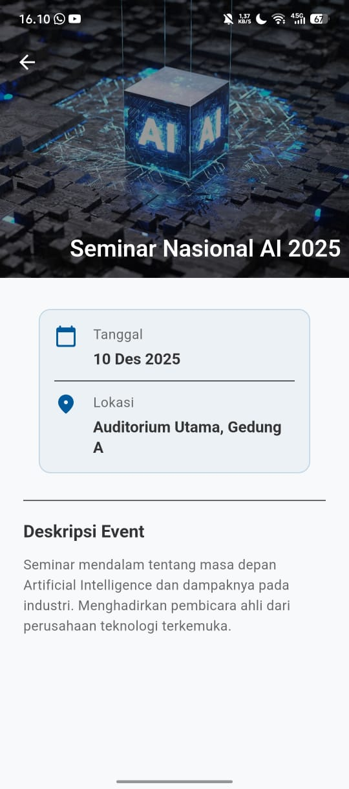
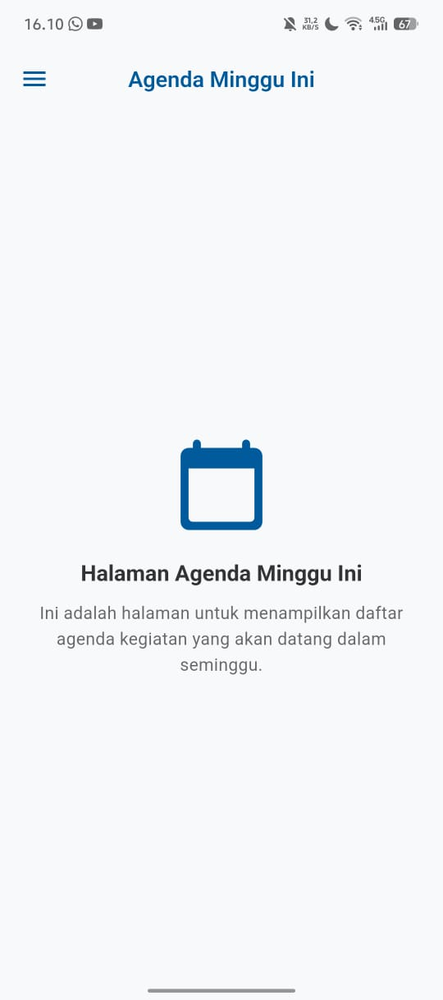
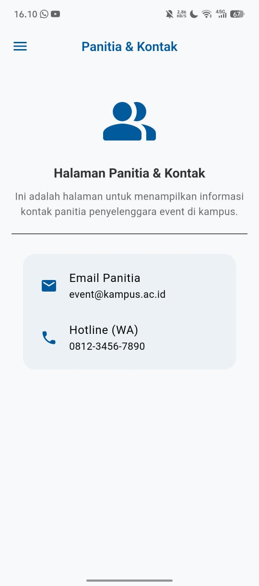
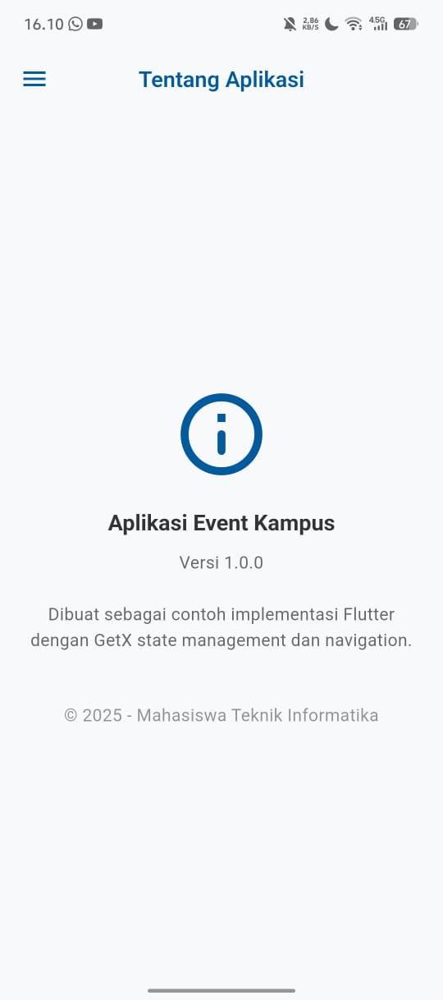

# 🎓 Aplikasi Event Kampus (Paket 6)

<p align="center">
  
  
  
</p>

Aplikasi mobile berbasis **Flutter** yang mengimplementasikan **state management** dan **navigasi menggunakan GetX**.
Aplikasi ini menampilkan informasi dan daftar kegiatan kampus dengan tampilan modern, responsif, dan mendukung **Dark Mode**.

Proyek ini dibuat untuk memenuhi tugas **Pemrograman Mobile**.

---

## 📌 Navigasi

- [Identitas Diri](#identitas-diri)
- [Fitur Aplikasi](#fitur-aplikasi)
- [Teknologi yang Digunakan](#teknologi-yang-digunakan)
- [Struktur Aplikasi](#struktur-aplikasi)
- [Demo Aplikasi](#demo-aplikasi)
- [Cara Menjalankan Aplikasi](#cara-menjalankan-aplikasi)
- [Lisensi](#lisensi)

---

## 🧑‍💻 Identitas Diri

| Keterangan | Data |
|-------------|------|
| **Nama** | Defit Bagus Saputra |
| **NIM** | H1D023036 |
| **Kelas** | Pemrograman Mobile A |
| **Jurusan** | Informatika |
| **Universitas** | Universitas Jenderal Soedirman |

---

## ✨ Fitur Aplikasi

Aplikasi ini memiliki beberapa halaman utama sesuai dengan instruksi **(Paket 6)**:

* 🏠 **Home (Daftar Event)**
    * Menampilkan daftar semua event kampus. Setiap event ditampilkan menggunakan **Card kustom**.

* 📅 **Detail Event**
    * Menampilkan deskripsi, tanggal, dan lokasi lengkap dari event yang dipilih.
    * Menggunakan **SliverAppBar** untuk tampilan gambar header yang dinamis.

* 🗓️ **Agenda Minggu Ini**
    * Halaman statis yang menampilkan agenda kampus.

* 👥 **Panitia & Kontak**
    * Halaman statis untuk informasi kontak panitia.

* ℹ️ **Tentang Aplikasi**
    * Menampilkan informasi versi aplikasi.

* 🧭 **Navigasi Drawer**
    * Drawer kustom untuk menu navigasi utama menggunakan **Get.toNamed()**.

* 🧩 **Widget Kustom**
    * `EventCard`
    * `AppDrawer`

* 🌗 **Tema Modern**
    * Light Mode dan Dark Mode profesional
    * Menggunakan **google_fonts (Poppins)**

---

## 🛠️ Teknologi yang Digunakan

| Teknologi | Deskripsi |
|------------|------------|
| **Flutter** | Framework UI cross-platform |
| **Dart** | Bahasa pemrograman Flutter |
| **GetX** | State Management, Navigasi, dan Dependency Injection |
| **Google Fonts** | Menggunakan font *Poppins* untuk tampilan modern |

---

## 🧱 Struktur Aplikasi

Saya menambahkan folder `assets` untuk menyimpan semua gambar dan *font* yang dibutuhkan oleh aplikasi.

```plaintext
lib/
├── main.dart # Titik masuk utama dan konfigurasi Tema (Light & Dark)
├── app/
│ ├── data/
│ │ └── models/
│ │ └── event_model.dart # Model untuk data event
│ ├── modules/
│ │ ├── about/ # Modul 'Tentang' (Binding, Controller, View)
│ │ ├── agenda/ # Modul 'Agenda' (Binding, Controller, View)
│ │ ├── contact/ # Modul 'Kontak' (Binding, Controller, View)
│ │ ├── event_detail/ # Modul 'Detail Event' (Binding, Controller, View)
│ │ └── home/ # Modul 'Home' (Binding, Controller, View)
│ ├── routes/
│ │ ├── app_pages.dart # Definisi GetPage (halaman & binding)
│ │ └── app_routes.dart # Definisi nama rute (static const)
│ └── widgets/
│ ├── app_drawer.dart # Widget custom (Drawer)
│ └── event_card.dart # Widget custom (Kartu Event)
└── ...
assets/
├── home.jpeg
├── side_bar.jpeg
├── agenda.jpeg
├── contact.jpeg
├── about.jpeg
├── detail.jpeg
└── demo.gif
````

*(Catatan: Jangan lupa daftarkan folder `assets/` di file `pubspec.yaml` Anda)*

-----

## 📱 Demo Aplikasi

### 🎥 Demo GIF

\<p align="center"\>
\
\</p\>

-----

### 🖼️ Screenshot Aplikasi

| Halaman | Tampilan |
|----------|-----------|
| **Home (Light)** | \ |
| **Detail Event** | \ |
| **Menu Drawer** | \ |
| **Agenda** | \ |
| **Kontak** | \ |
| **Tentang** | \ |
| **Home (Dark)** | [Tambahkan Screenshot Home Dark Mode] |

-----

## 🚀 Cara Menjalankan Aplikasi

### 1️⃣ Clone Repository *(Opsional)*

Jika proyek ini diunggah ke GitHub:

```bash
git clone [https://github.com/DefitSaputra/event_kampus_app]
```

### 2️⃣ Masuk ke Direktori Proyek

```bash
cd [event_kampus_app]
```

### 3️⃣ Install Dependencies

```bash
flutter pub get
```

### 4️⃣ Jalankan Aplikasi

```bash
flutter run
```

-----

## ⚖️ Lisensi

Proyek ini dilisensikan di bawah [MIT License](https://www.google.com/search?q=LICENSE).

```
```